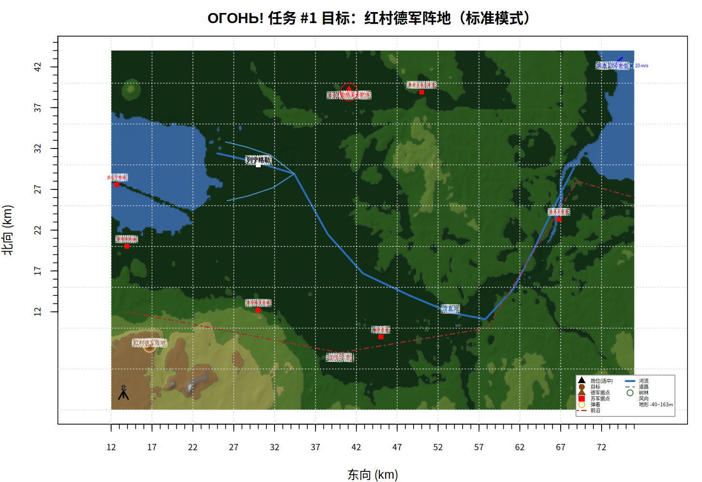
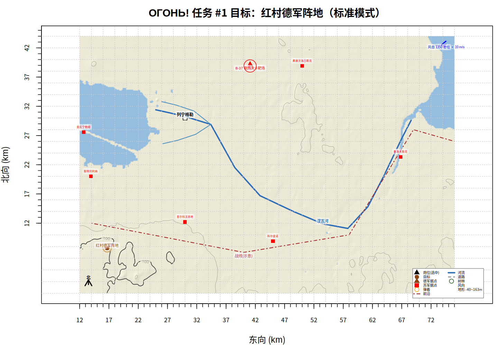
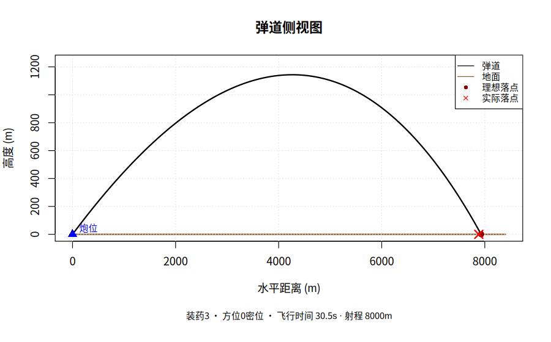

# ОГОНЬ!（Ogon!）—— 炮兵射击指挥游戏

[English](README.md)

[](https://github.com/RichardLitt/standard-readme)
[](https://spdx.org/licenses/MIT.html)
[](https://deepseek.com)
[](https://github.com/deepseek-ai/deepseek-harness)
[](https://www.r-project.org/)

纯 base R 回合制炮兵射击指挥游戏：密位、装药射表、观察员修正、五种史实火炮。

俄语 «Огонь!» 意为「开火」。仓库名是 `ogon-artillery`。你担任炮兵连长：计算诸元、下达射击命令、按观察员报告修正弹着。游戏只用 base R 图形，运行期不需要任何 R 包。

## 截图

|                 地图·照片样式                  |                  地图·战术样式                   |                弹道侧视图                |
| :--------------------------------------------: | :----------------------------------------------: | :--------------------------------------: |
|  |  |  |

截图是列宁格勒历史场景，使用真实地形（64×44 km）。

## 目录

- [背景](#背景)
- [安装](#安装)
  - [依赖](#依赖)
  - [从源码运行](#从源码运行)
  - [卸载](#卸载)
- [用法](#用法)
- [功能](#功能)
- [地图样式](#地图样式)
- [架构](#架构)
- [已知限制](#已知限制)
- [命令接口](#命令接口)
- [维护者](#维护者)
- [致谢](#致谢)
- [参与](#参与)
- [更新记录](#更新记录)
- [许可证](#许可证)

## 背景

炮兵射击指挥是一个循环：算诸元、射击、观察员报弹着、修正。本项目把这个循环做成游戏，在 R 控制台里玩。

所有数字来自真实模型。每发弹按质点弹道加平方律空气阻力飞行。每门炮的阻力系数用它的史实最大射程校准。每门炮的散布按概率误差计算。风和地形高度会改变落点。

游戏界面是中文，教程与手册也是中文。

由 DeepSeek V4 通过 [DeepSeek Harness](https://github.com/deepseek-ai/deepseek-harness) 开发。

## 安装

### 依赖

- R ≥ 4.2。运行期不需要任何 R 包。
- 可选，用于真实地形：`terra` 与 `png`（列宁格勒场景），或 `elevatr` 与 `terra`（任意区域）。这些包需要联网。

### 从源码运行

```bash
git clone https://github.com/iwinoid/ogon-artillery.git
cd ogon-artillery
Rscript main.R
```

RStudio 里打开 `main.R`，点 **Source**。游戏自己定位所在目录，工作目录在哪都不影响。

### 卸载

删除目录即可。游戏只写入 `docs/`（地图帧与试玩日志）。

## 用法

1. 启动游戏，出现主菜单。
2. 选 `1`（开始战役）。子菜单提供 遭遇战、史实战役、教程关。
3. 先选教程关。目标大，无风。
4. 输入 `诸元 target`（算诸元）。计算器给出方位、高低、装药。
5. 输入 `射击 <方位> <高低> <装药> 1`（试射一发）。
6. 看观察员报告。输入 `修正 <距离偏差> <方向偏差>`（修正）。
7. 输入 `急促 <方位> <高低> <装药>`（3 发急促射）或 `效力`（效力射）。
8. 输入 `结束`（结算）看成绩。

命令行参数：

| 参数 | 作用 |
| --- | --- |
| `--mode arcade\|std\|hard` | 难度。街机给射击建议并减小散布，全真禁用计算器。 |
| `--gun D20\|M46\|M109\|B4\|B37` | 选择火炮。 |
| `--seed N` | 固定随机种子。同一 seed 复现同一局。 |
| `--scenario leningrad` | 进入列宁格勒历史场景。 |
| `--map FILE` | 加载 DEM 缓存，使用真实地形。 |
| `--test FILE --pngdir DIR` | 跑脚本化对局并输出地图帧。 |
| `--nocolor` | 关闭 ANSI 颜色。 |

完整教程见 [TUTORIAL.md](TUTORIAL.md)。

## 功能

- **弹道**：质点加平方律阻力，RK4 积分步长 0.2 s，含风与地形高度。每门炮的阻力系数按史实最大射程校准。
- **密位**：整圆 6000 密位。方位与高低都用密位。游戏按射程选装药并内插射表。
- **指挥所计算器**（`诸元`）：方位、风修正、高差修正，并在真实地形上迭代求解。
- **观察员报告**：近弹、远弹、偏左、偏右，单位米。`修正` 命令换成密位。
- **五种火炮**：152 mm D-20、130 mm M-46、155 mm M109A6、203 mm B-4、406 mm B-37，数据近似史实。
- **战役**：四类目标、随机位置、随机气象，弹药与射击命令双限，S~C 评级。
- **历史场景**：1942 年列宁格勒保卫战。406 mm B-37 在 64×44 km 真实地形图上轰击 7 个史实目标。
- **侦察误差**：战役中上报坐标与真值差 5~15 m。试射后修正即可消除。
- **教程关** 与三种难度模式。
- **可复现对局**：`--seed` 固定地形、目标、气象与弹着。

## 地图样式

游戏画两种地图样式。用 `地图样式` 命令切换，或用主菜单第 4 项。

| 样式 | 外观 |
| --- | --- |
| 照片 | 每 25 m 一档等高带填色加山体阴影，蓝色水面，宽幅画布 |
| 战术 | 纸色底，平滑等高线加计曲线注记，浅蓝水面 |

地图还随幅面自适应：画布跟随地图宽高比，网格间距跟随幅宽。

## 架构

游戏由若干 R 模块组成。`main.R` 按此顺序加载它们。

| 文件 | 作用 |
| --- | --- |
| `main.R` | 入口。解析参数、定位游戏目录、启动菜单或脚本化对局。 |
| `config.R` | 火炮数据、世界常量、难度模式、炮位预设。 |
| `ballistics.R` | 弹道积分、散布、射表、阻力校准、弹道侧视图。 |
| `map.R` | 地形生成、DEM 加载、地图渲染。 |
| `fdc.R` | 指挥所计算器。 |
| `mission.R` | 任务生成、观察员报告、评分。 |
| `ui.R` | 控制台面板、帮助文本、游戏内教程。 |
| `game.R` | 状态机、射击执行、命令分发、主循环。 |
| `tools/` | DEM 下载工具、射表生成脚本、场景渲染辅助。 |
| `tests/` | 测试脚本与 AI 试玩。 |

一发弹的数据流：

```
命令（射击 / 急促 / 效力）
  → fire_volley（game.R）
    → trajectory（ballistics.R：RK4、风、地形）
    → disperse_impact（ballistics.R：概率误差）
  → observer_report（mission.R：近远、左右）
  → check_destroyed（mission.R：按真值判定）
  → draw_state（game.R → map.R）
```

## 已知限制

- 弹道是质点模型，没有旋转稳定与马格努斯效应。
- 阻力系数只在 45° 最大射程一点校准。
- 不做遮蔽判定。山脊后的目标仍可直瞄射击。
- 散布是距离与方向独立的正态模型。
- 列宁格勒 DEM 分辨率 150 m。地图有瓦片接缝伪影：芬兰湾内的对角线、x≈55 km 处的竖线。
- 默认自由地图 20×20 km。M-46 的 27 km 与 B-37 的 45.5 km 需要更大的地图。
- 地图渲染还在改。颜色、标注、地形分辨率会随版本变化。

## 命令接口

游戏命令就是接口。中文名与英文名等价。

| 命令 | 别名 | 作用 |
| --- | --- | --- |
| `帮助` | `help` | 命令列表 |
| `教程` | `tutorial` | 游戏内速成教程 |
| `任务` | `mission` | 任务简报 |
| `地图` | `map` | 重绘地图 |
| `情况` | `status` | 状态、弹药、风况 |
| `炮位` / `选择 <n>` | `guns` / `sel` | 列炮位 / 切换炮位 |
| `射表 [装药]` | `table` | 查射表 |
| `诸元 <x> <y>` 或 `诸元 target` | `calc` | 计算诸元 |
| `射击 <方位> <高低> <装药> [弹数]` | `fire` | 射击 1~6 发 |
| `急促 <方位> <高低> <装药>` | `rapid` | 3 发急促射 |
| `效力 <方位> <高低> <装药>` | `eff` | 效力射，最多 6 发，命中即停 |
| `修正 <距离偏差> <方向偏差>` | `corr` | 观察员报告换成密位 |
| `弹道 [n]` | `traj` | 第 n 发弹道侧视图 |
| `气象` | `wind` | 风况 |
| `地图样式 [战术/照片]` | `style` | 切换地图样式 |
| `成绩` | `score` | 当前成绩 |
| `结束` | `end` | 结束任务并结算 |
| `退出` | `quit` | 退出游戏 |

## 维护者

- [Iwinoid](https://github.com/iwinoid) — iwinoid@outlook.com

## 致谢

- [R 项目](https://www.r-project.org/) 与其 base graphics。
- [AWS Terrain Tiles](https://registry.opendata.aws/terrain-tiles/) 提供列宁格勒高程数据。
- 维基百科提供涅瓦河沿线城镇坐标。

## 参与

问题与缺陷请提到 [GitHub Issues](https://github.com/iwinoid/ogon-artillery/issues)。接受 Pull Request。

开发在本地工作树进行，本仓库接收快照。提 PR 前请保证测试通过：

```bash
Rscript tests/test_ballistics.R
Rscript tests/test_map.R
Rscript tests/test_scenario.R
Rscript tests/test_game.R
```

## 更新记录

- **0.1.0**（2026-09-13）：首个公开快照。含带阻力校准的弹道模型、密位与射表、指挥所计算器、观察员报告、五种火炮、随机战役、真实地形列宁格勒场景、教程关、三种难度、侦察误差、两种地图样式、测试套件。

## 许可证

[MIT](LICENSE) © Iwinoid
